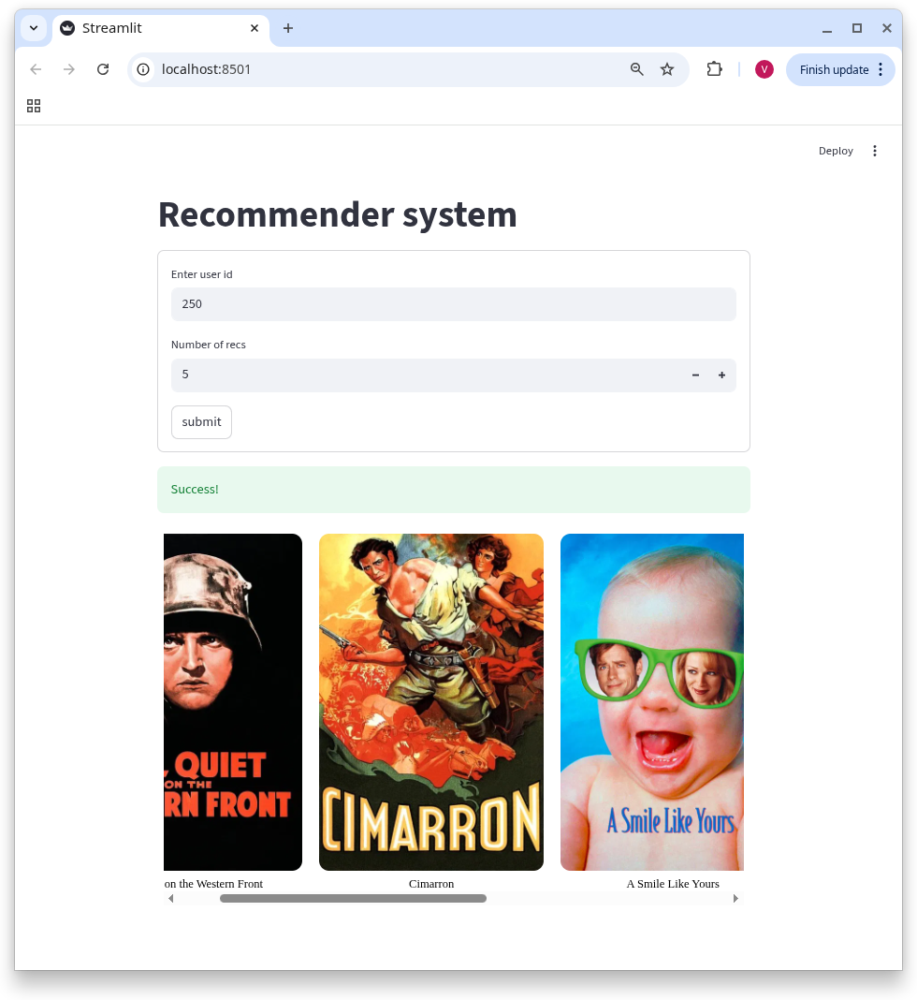

# Movie Recommendation System

This project is a movie recommendation system that uses various machine learning models for recommendations, as well as integrates with external APIs to obtain movie data (TMDb). A web application built on Streamlit allows users to receive recommendations based on their preferences.

## Main components

- FastAPI: a server for providing an API for receiving recommendations.
- Streamlit: A web interface for user interaction.
- TMDb API: used to get additional data about movies (for example, title, poster).

## scheme

1) candidate generation - svd(surprice)
2) ranking - catboost

## Technology

- Python: the main programming language.
- FastAPI: for creating the server side of the API.
- Streamlit: for creating a web interface.
- requests: for working with external APIs (OMDb and TMDb).
- CatBoost, Surprise (SVD): for building recommendation models.
